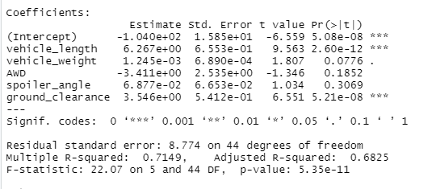
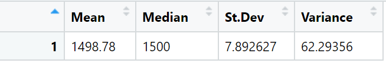
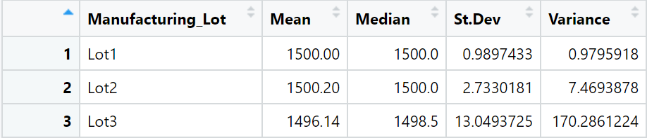
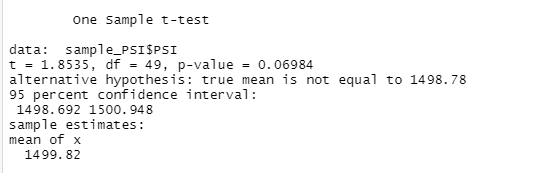
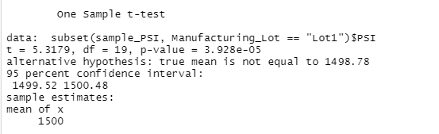
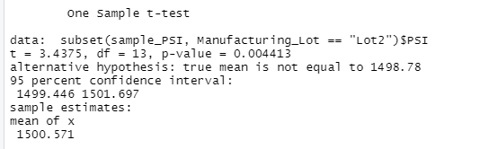
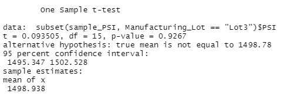

# MechaCar_Statistical_Analysis

# Linear Regression to Predict MPG

- The regression shows that vehicle weight, drivetype (AWD or not) and, a vehicle's spoiler angle all have a non-random effect on the variation in the model. 
- The slope of the model is not considered zero because the variables tested did have an effect on MPG.
- This model does a fairly strong job predicting mpg of MechaCar prototypes. With an R-Squared measure of .7149, we predict that abot 71.5% of the variation in mpg for MechaCar prototypes can be accounted for by the variables used in this regression.

# Summary Statistics on Suspension Coils

- The design specifications for the MechaCar suspension coils dictate that the variance of the suspension coils must not exceed 100 pounds per square inch.
- Based on our current manufacturing data, the design specification is met for all lots in total, and for lots 1 & 2 individually. 
- The suspension coils for lot 3 had a variance of ~170 pounds per square inch, which does not meet the criteria. 

# T-Tests on Suspension Coils

- with a p-value above .05, we fail to reject the null hypothesis that the mean PSI of all manufacturing lots is equal to the mean PSI of the population at the 95% confidence level.  

- with a p-value below .05, we reject the null hypothesis that the mean PSI of lot 1 is equal to the mean PSI of the population at the 95% confidence level.

- with a p-value below .05, we reject the null hypothesis that the mean PSI of lot 2 is equal to the mean PSI of the population at the 95% confidence level.

- with a p-value above .05, we fail to reject the null hypothesis that the mean PSI of lot 3 is equal to the mean PSI of the population at the 95% confidence level.

# Study Design: MechaCar vs Competition

One car feature that is of paramount to almost all car-buyers is safety. Tastes differ when it comes to other features in a vehicle, but nobody wants to sacrifice on safety. A design to compare the safety ratings of MechaCar vehicles against the competition. 

Running a two-sample T-test with MechaCar vehicles and vehicles from another manufacturer could help directly compare the safety of MechaCar to that of another manufacturer.
H0: mean(MechaCar safety rating) = mean(manufacturerX safety rating)
Ha: mean(MechaCar safety rating) ≠ mean(manufacturerX safety rating)

- This T-test could be run against any manufacturer MechaCar wants to compare their safety rating's with. 
- The only data necessary to run this test would be the individual safety rating of each car for both manufacturers.
