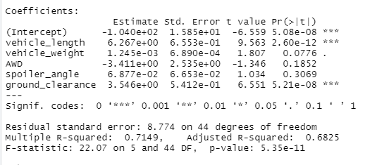
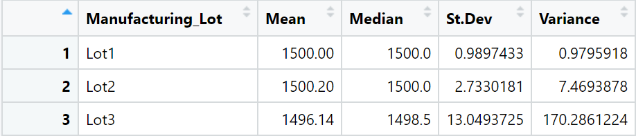
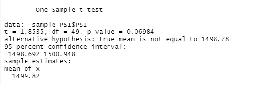
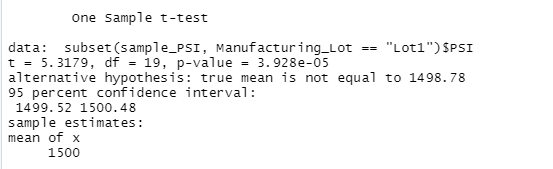
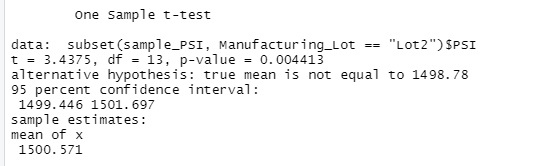
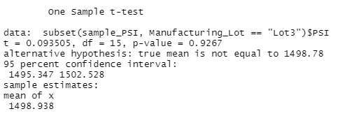

# MechaCar_Statistical_Analysis

# Linear Regression to Predict MPG

- The regression shows that vehicle weight, drivetype (AWD or not) and, a vehicle's spoiler angle all have a non-random effect on the variation in the model. 
- The slope of the model is not considered zero because the variables tested did have an effect on MPG.
- This model does a fairly strong job predicting mpg of MechaCar prototypes. With an R-Squared measure of .7149, we predict that abot 71.5% of the variation in mpg for MechaCar prototypes can be accounted for by the variables used in this regression.

# Summary Statistics on Suspension Coils

- The design specifications for the MechaCar suspension coils dictate that the variance of the suspension coils must not exceed 100 pounds per square inch.
- Based on our current manufacturing data, the design specification is met for all lots in total, and for lots 1 & 2 individually. 
- The suspension coils for lot 3 had a variance of ~170 pounds per square inch, which does not meet the criteria. 

# T-Tests on Suspension Coils

